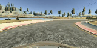
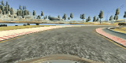

# **Driving Behavioral Cloning** 


---

<!-- MarkdownTOC autolink="true" bracket="round"-->

- [Project Structure](#project-structure)
- [Model Architecture and Training Strategy](#model-architecture-and-training-strategy)
  - [1. Solution Design Approach](#1-solution-design-approach)
  - [2. Final Model Architecture](#2-final-model-architecture)
  - [3. Creation of the Training Set & Training Process](#3-creation-of-the-training-set--training-process)
  - [4. Model fine tuning](#4-model-fine-tuning)

<!-- /MarkdownTOC -->


[//]: # (Image References)

[gif1]: .writeup_img/animation.gif 
[image1]: ./writeup_img/flipped.png 
[image2]: ./writeup_img/original.png 
[image3]: ./writeup_img/training.png

[image4]: ./examples/placeholder_small.png "Recovery Image"
[image5]: ./examples/placeholder_small.png "Recovery Image"
[image6]: ./examples/placeholder_small.png "Normal Image"
[image7]: ./examples/placeholder_small.png "Flipped Image"

[traffic_sign]: https://github.com/yangliupku/traffic_sign_classification

---
## Project Structure


My project includes the following files:

* model.py containing the script to create and train the model
* drive.py for driving the car in autonomous mode
* model.hdf5 containing a trained convolution neural network 
* video.mp4 is the video generated by simulator in autonomous mode
* README.md summarizing the results

Using the Udacity provided simulator and my drive.py file, the car can be driven autonomously around the track by executing 
```sh python drive.py model.hdf5
```
## Model Architecture and Training Strategy

### 1. Solution Design Approach

The overall strategy for deriving a model architecture was to build a neural network to predict the steering angle frame by frame. 

My first step was to use a convolution neural network model similar to the one I used in [traffic sign classification project][traffic_sign]. I thought this model might be appropriate because on one hand, it's powerful enough to learn the features for effective steering prediction. On the other hand, it not too large to prone to overfit, since we only have 4400 training images.

In order to gauge how well the model was working, I split my image and steering angle data into a training and validation set (70/30 split).  Due to the employment of dropout, the model didn't show severe sign of overfitting. 

The final step was to run the simulator to see how well the car was driving around track one. On the first try, the car almost stayed on track except for the last right turn. To improve the behavior, I increased the correction angle for left and right camera to encourage the car to make larger steering angles, thus restore to the center of road faster when it's off. 

At the end of the process, the vehicle is able to drive autonomously around the track without leaving the road.


### 2. Final Model Architecture

The final model architecture (model.py lines 54-86) consisted of a convolution neural network with the following layers and layer sizes  

```
                                  Type               Size     Dropout (keep p)
· · · · · · · · · ·    input      160x320x3    
. . . . . . . . . .    preprocess (cropping, batch_norm)
@ @ @ @ @ @ @ @ @ @    Layer 1    3x3 Conv, maxpool   32       0.8        
∶∶∶∶∶∶∶∶∶∶∶∶∶∶∶∶∶∶∶    
  @ @ @ @ @ @ @ @      Layer 2    3x3 Conv, maxpool   64      0.8     
  ∶∶∶∶∶∶∶∶∶∶∶∶∶∶∶     
    @ @ @ @ @ @        Layer 3    3x3 Conv, maxpool   128      0.7  
    ∶∶∶∶∶∶∶∶∶∶∶
     @ @ @ @ @         Layer 4    3x3 Conv, maxpool   256      0.7  
     ∶∶∶∶∶∶∶∶∶
     \x/x\x\x/         Layer 5    FC                  128      0.5    
      · · · ·         
      \x/x\x/          Output     FC                  1             
         ·                      
 
```

### 3. Creation of the Training Set & Training Process

To capture good driving behavior, I recorded two laps on track one using center lane driving, and use the three camera views to train the model. I applied 0.4 to the left camera and -0.4 to the right camera to encourage the car to stay in the lane. After the collection process, I had 6287 images (including all three camera view).

To augment the data set, I also flipped images and angles thinking that this would help balance the left and right steering.  For example, here is an image that has then been flipped:

![alt text][image1]
![alt text][image2]

The data proprocessing is built into the nerual net model. The first layer of the network crop 40 pixels from the top and bottom of the image, helping the network to focus on the road. The second layer apply batch normalization, which will learn to center and scale the pixel values. 


I finally randomly shuffled the data set and put 30% of the data into a validation set. 

I used this training data for training the model. Early stoppong based on the loss on validation set helped prevent overfitting. The ideal number of epochs was 400 as evidenced by the training plot.  I used an adam optimizer with `learning_rate = 5e-5` so that manually training the learning rate wasn't necessary.

![alt text][image3]

### 4. Model fine tuning

On the first try, I used 0.25 and -0.25 as the steerign correction for left and right camera respectively.  The car almost stayed on track except for the last right turn, where it went a bit out of track, then restored to the center of road. See the gif below.




To improve the behavior, I increased the correction angle for left and right camera to 0.4 and -0.4. This  encouraged the car to make larger steering angles, thus restore to the center of road faster when it's off. As a result, the car went though the turn smoothly without touching the curb.



